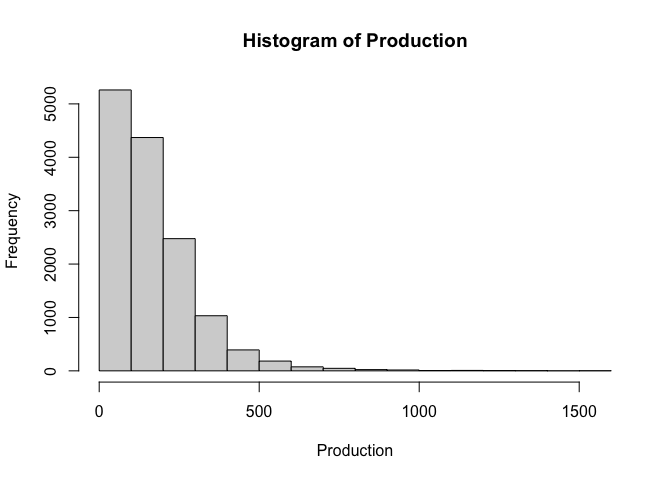
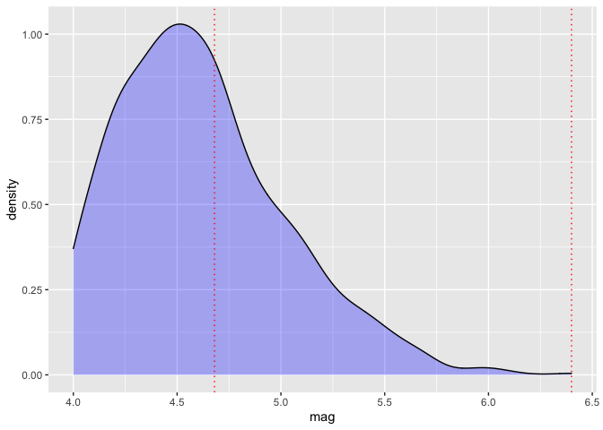

<!-- README.md is generated from README.Rmd. Please edit that file -->

# stratifyR 1.0-3

The goal of stratifyR is to construct stratification boundaries using
either the continuous variable in your data or a hypothetical
distribution for your variable.

## Installation

You can install stratifyR using:

``` r
install.packages("stratifyR")
```

## Example

This is a basic example which shows you how to solve a common
stratification problem:

``` r
library(stratifyR)
#> Loading required package: fitdistrplus
#> Loading required package: MASS
#> Loading required package: survival
#> Loading required package: zipfR
#> Loading required package: actuar
#> 
#> Attaching package: 'actuar'
#> The following objects are masked from 'package:stats':
#> 
#>     sd, var
#> The following object is masked from 'package:grDevices':
#> 
#>     cm
#> Loading required package: triangle
#> Loading required package: mc2d
#> Loading required package: mvtnorm
#> 
#> Attaching package: 'mc2d'
#> The following objects are masked from 'package:base':
#> 
#>     pmax, pmin
## basic example code using data
data(sugarcane)
Production <- sugarcane$Production
hist(Production)
```



``` r
res <- strata.data(Production, h = 2, n=1000)
#> The program is running, it'll take some time!
summary(res)
#> _____________________________________________
#> Optimum Strata Boundaries for h = 2 
#> Data Range: [0.42, 1570.38] with d = 1569.96
#> Best-fit Frequency Distribution:  gamma 
#> Parameter estimate(s):  
#>       shape        rate 
#> 1.520409984 0.009226811 
#> ____________________________________________________
#>  Strata     OSB   Wh       Vh   WhSh   nh    Nh   fh
#>       1  195.18 0.68  2832.16 36.219  458  9456 0.05
#>       2 1570.38 0.32 18071.08 42.939  542  4438 0.12
#>   Total         1.00 20903.24 79.158 1000 13894 0.07
#> ____________________________________________________

## basic example code using distribution
res <- strata.distr(h=2, initval=0.65, dist=68, distr = "gamma",
params = c(shape=3.8, rate=0.55), n=500, N=10000)
#> The program is running, it'll take some time!
summary(res)
#> _____________________________________________
#> Optimum Strata Boundaries for h = 2 
#> Data Range: [0.65, 68.65] with d = 68
#> Best-fit Frequency Distribution:  gamma 
#> Parameter estimate(s):  
#> shape  rate 
#>  3.80  0.55 
#> ____________________________________________________
#>  Strata   OSB   Wh    Vh  WhSh  nh    Nh   fh
#>       1  7.47 0.63  2.61 1.014 247  6279 0.04
#>       2 68.65 0.37  7.83 1.041 253  3721 0.07
#>   Total       1.00 10.44 2.055 500 10000 0.05
#> ____________________________________________________
```

The functions can be dynamically used to visualize the the strata
boundaries, for 2 strata, over the density (or observations) of the
“mag” variable from the quakes data (with purrr and ggplot2 packages
loaded).

``` r
library(stratifyR)
library(ggplot2)
res <- strata.distr(h=2, initval=4, dist=2.4, distr = "lnorm", 
          params = c(meanlog=1.52681032, sdlog=0.08503554), n=300, N=1000)
#> The program is running, it'll take some time!
ggplot(data=quakes, aes(x = mag)) +
      geom_density(fill = "blue", colour = "black", alpha = 0.3) +
      geom_vline(xintercept = res$OSB, linetype = "dotted", color = "red")
```

 Read the
stratifyR vignette for a complete documentation and many more examples
using 10 different distributions.
